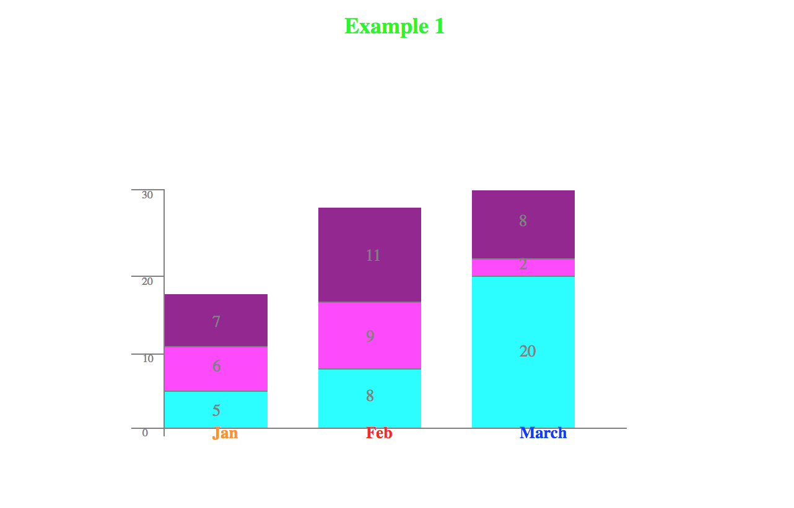
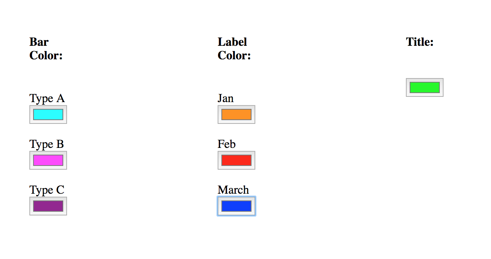

#Bar Chart Stretch Project

##About
This project is part of a prep work for Lighthouse Labs Web Development Bootcamp.

##Example Screenshots

##API functions
* function drawBarChart(data, options, element)
  * Data - Values and Labels
  * Options - Bar Chart Size, Title, Title Size, Position of values inside bar, space between bars and labels for each colour.
* function createBars(value, number)
  * With values and numbers the bars are created
* function createBarColorWell(number)
  * Colour picker is created for each number on bar chart.

##Feature list
* Stacked bar chart
* Customized colours, per value
* Customizable labels and colours
* Customized title size and colour

##Known Issues
* Graph is not well displayed if values are well over 100.
* Values and labels are not well contained inside of cells.

##Features on the roadmap

* Validation for the inputs
* User can interactively change values and options without starting over.

##External Resources

* [Example graph](https://nces.ed.gov/nceskids/createagraph/)

* [jQuery documentation](https://api.jquery.com/)

* [w3schools](https://www.w3schools.com/)

* [MDN](https://developer.mozilla.org/en-US/)

* [StackOverflow](https://stackoverflow.com/)
